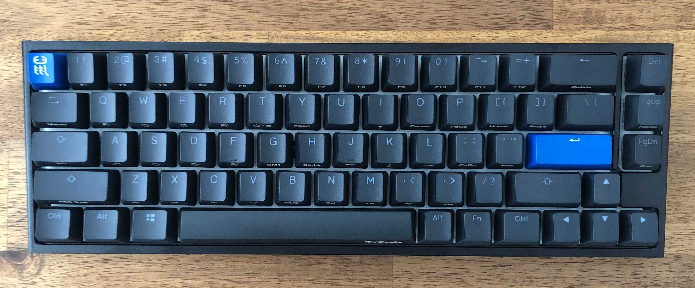
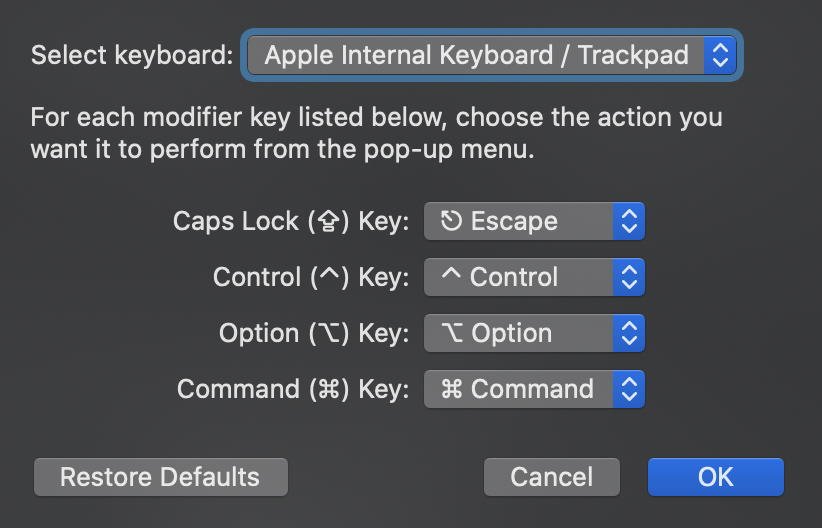
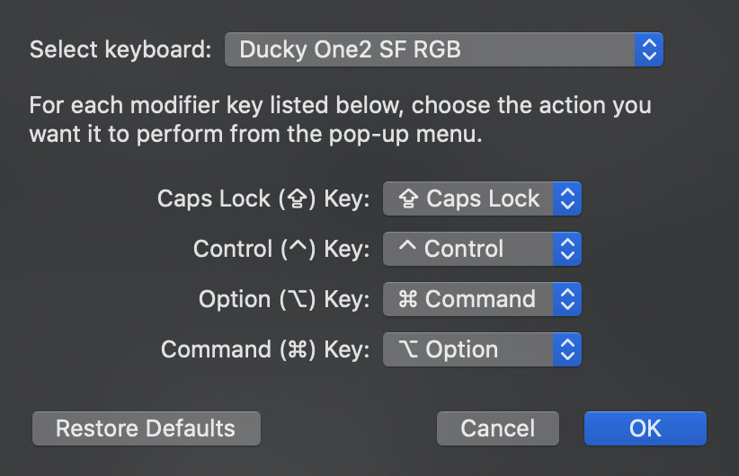

# ducky-one-2-sf-config
Remapping keys for Ducky One 2 SF 



OS X allows us to remap modifier keys. This is great. However, when we're on a smaller keyboard, in particular one that's missing the F Row, we need to do some jiggery pokery to get things set up the way we like.

When using the built-in keyboard, I change the modfier keys to look like this:



When using the Ducky One 2, I change the modifier keys to look like this:


Create plist file: `sudo code /Library/LaunchDaemons/dev.lar.ducky-one-2-sf-remap.plist`with the following contents:


```plist
<?xml version="1.0" encoding="UTF-8"?>
<!DOCTYPE plist PUBLIC "-//Apple//DTD PLIST 1.0//EN" "http://www.apple.com/DTDs/PropertyList-1.0.dtd">
<plist version="1.0">
  <dict>
    <key>Label</key>
    <string>org.custom.keyboard-remap</string>
    <key>ProgramArguments</key>
    <array>
      <string>/usr/bin/hidutil</string>
      <string>property</string>
      <string>--set</string>
      <string>{"UserKeyMapping": [{"HIDKeyboardModifierMappingSrc":0x700000029,"HIDKeyboardModifierMappingDst":0x700000035}] }</string>
    </array>
    <key>RunAtLoad</key>
    <true/>
    <key>KeepAlive</key>
    <false/>
  </dict>
</plist>
```

The file above will map `esc` to `` ` `` and `CAPS` to `esc`

To get it to map each time you start you machine, do this:


`sudo launchctl load -w /Library/LaunchDaemons/dev.lar.ducky-one-2-sf-remap.plist`

`sudo launchctl list | grep dev.lar`